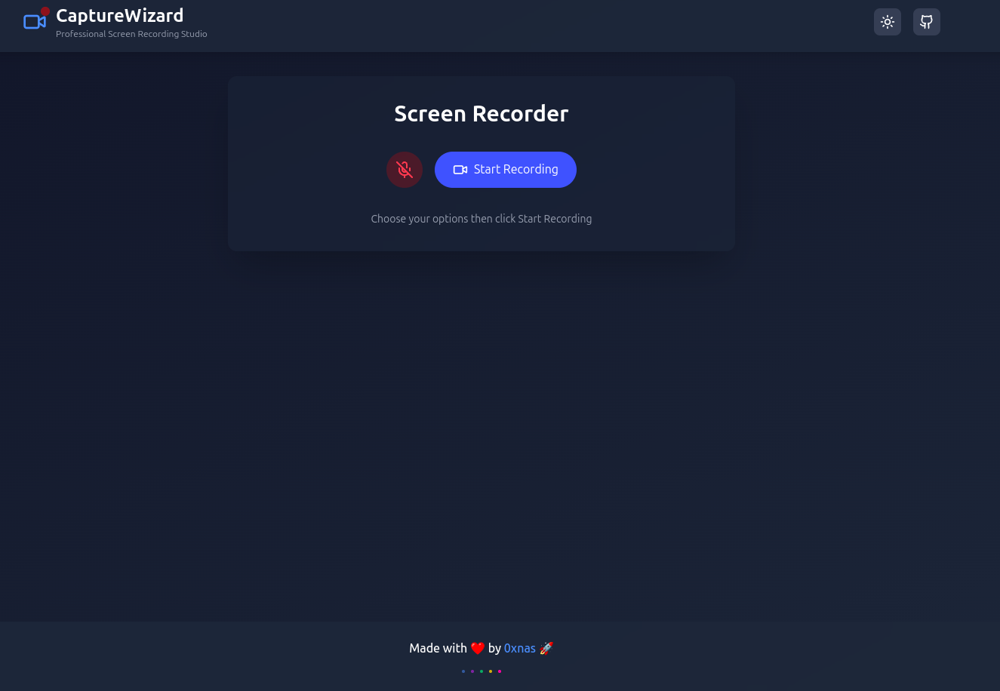

# WebLoom - Screen Recording Web App



## 🚀 Overview
WebLoom is a simple yet powerful screen recording web application built with **React** and **Tailwind CSS**. It allows users to record their screens and download the recordings directly without requiring any backend or cloud storage.

## ✨ Features
- 🎥 **Record Screen** - Capture your screen with system audio
- 📥 **Download Recording** - Save recordings as `.webm` files
- ⚡ **No Backend Required** - Works fully client-side
- 🎨 **Clean UI** - Built with Tailwind CSS

## 🛠 Tech Stack
- **React** - Frontend framework
- **Tailwind CSS** - Styling
- **MediaRecorder API** - Screen recording

## 📦 Installation
```sh
# Clone the repository
git clone https://github.com/iamnas/webloom.git
cd webloom

# Install dependencies
npm install  # or pnpm install

# Start the development server
npm start
```

## 🎬 Usage
1. Click **Start Recording** and select the screen/tab to capture.
2. Click **Stop Recording** to end the session.
3. Preview your recording and **Download** it as a `.webm` file.

## 📸 Screenshots


## 🌍 Live Demo
🔗 [WebLoom Demo](./public/recording.webm) 

## 🤝 Contributing
Contributions are welcome! Feel free to fork this repo, open issues, or submit pull requests.

## 📜 License
MIT License © 2025 [Nas (0xnas)](https://github.com/iamnas)

---
Made with ❤️ by 0xnas 🚀

